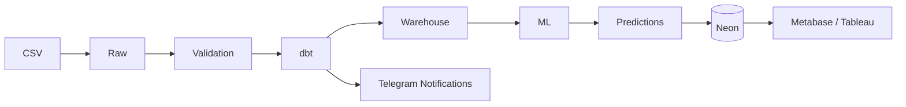
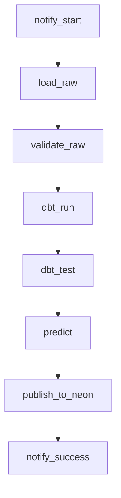

<div align="center">

# DataCo Supply Chain — Data Engineering + ML Platform

**End-to-end data platform that turns a raw 180k-row CSV export into a governed Kimball warehouse, a fraud-detection model, and live BI dashboards — fully orchestrated and containerized.**

<br>

[](https://www.python.org/)
[](https://www.postgresql.org/)
[](https://airflow.apache.org/)
[](https://www.getdbt.com/)
[](https://www.docker.com/)
[](https://neon.tech/)
[](https://www.metabase.com/)
[](https://scikit-learn.org/)
[](LICENSE)

<div align="center">

# DataCo Supply Chain — Data Engineering + ML Platform

**End-to-end data platform that turns a raw 180k-row CSV export into a governed Kimball warehouse, a fraud-detection model, and live BI dashboards — fully orchestrated and containerized.**

[Demo](#demo) •
[Architecture](docs/ARCHITECTURE.md) •
[Installation](#installation) •
[Documentation](#documentation)

<br>

<!-- Badges here -->

</div>

---</div>

---

## Overview

> **What is this?** A production-style pipeline that ingests the [DataCo Smart Supply Chain](https://www.kaggle.com/datasets/shashwatwork/dataco-smart-supply-chain-for-big-data-analysis) dataset (~180k order line items), models it as a Kimball star schema, engineers a Gold AI feature layer, trains a fraud-detection classifier, and serves everything to BI tools through a cloud-hosted read replica.

> **Why?** To demonstrate a realistic, end-to-end analytics engineering workflow — the kind of pipeline a data platform team ships in production — rather than a single notebook.

Built with **Airflow, dbt, PostgreSQL, scikit-learn, Neon, Metabase, and Docker.**

---

## Demo

<p align="center">
  
</p>

The demo shows the complete pipeline: Airflow orchestration → data validation → dbt transformations → ML prediction → Telegram notifications → Neon synchronization → Metabase dashboard.

---

## Architecture



Orchestrated daily by Airflow: `load_raw → validate_raw → dbt_run → dbt_test → predict → publish_to_neon`.

📖 Full technical documentation, data dictionary, and schema diagrams live in **[docs/ARCHITECTURE.md](docs/ARCHITECTURE.md)**.

---

## Tech Stack

| Layer | Technology |
|---|---|
| Orchestration | Apache Airflow |
| Transformation | dbt |
| Warehouse | PostgreSQL (Kimball star schema) |
| ML | scikit-learn (ExtraTreesClassifier) |
| BI Serving | Neon (Postgres) → Metabase / Tableau |
| Alerting | Telegram |
| Infra | Docker Compose |

---

## Features

- ✅ **Kimball star schema** — 4 dimensions + 1 incremental fact table, built entirely in dbt
- ✅ **Incremental everywhere** — raw loads, fact merges, and predictions are all idempotent
- ✅ **Gold AI feature table** — single source of truth for ML, engineered directly in SQL
- ✅ **Fraud detection model** — ExtraTreesClassifier with SMOTE-balanced training and a tuned decision threshold
- ✅ **Cloud BI serving layer** — read-only Neon replica for Tableau / Power BI / Metabase
- ✅ **Real-time monitoring** — Telegram notifications on pipeline start, success, and failure
- ✅ **51 dbt tests** — uniqueness, not-null, and referential integrity across the warehouse
- ✅ **One-command Docker setup** — no manual environment configuration

---

## Pipeline Flow



| Task | What it does |
|---|---|
| `load_raw` | Incremental CSV → PostgreSQL landing table |
| `validate_raw` | Data quality checks (nulls, duplicates, date ranges, status codes) |
| `dbt_run` | Builds staging views, dimensions, fact table, and Gold AI features |
| `dbt_test` | Runs 51 dbt tests (uniqueness, not-null, relationships) |
| `predict` | Scores new orders with the trained fraud model |
| `publish_to_neon` | Syncs 6 tables to the Neon cloud database |

Full lifecycle, retry behavior, and error handling are documented in [ARCHITECTURE.md](docs/ARCHITECTURE.md).

---

## Machine Learning

**Model:** ExtraTreesClassifier (300 estimators)
**Features:** 24 engineered features (payment, shipping, geography, temporal, financial)
**Threshold:** 0.30, tuned for F1 on the held-out test set

| Metric | Value |
|---|---|
| ROC-AUC | 0.9497 |
| Precision | 0.4013 |
| Recall | 0.3727 |
| F1 | 0.3865 |

📖 Feature engineering, resampling, and threshold optimization details are in [ARCHITECTURE.md](docs/ARCHITECTURE.md#ml-workflow).

---

## Dashboards

| Airflow | Metabase |
|---|---|
|  |  |

| Telegram | Tableau |
|---|---|
|  |  |

---

## Project Structure

```
├── airflow/          Airflow DAG definitions
├── dbt/              Staging, mart, and Gold AI dbt models
├── ml/               Training, prediction, and feature engineering
├── scripts/          Raw load, validation, and Neon publishing
├── notifications/    Telegram alerting
└── docs/             Full technical documentation
```

---

## Quick Start

### Prerequisites
- Docker & Docker Compose
- Git

### Installation

```bash
git clone https://github.com/Ziad-wael-hassan/DataCo_Supply_Chain.git
cd DataCo_Supply_Chain
cp .env.example .env      # fill in Neon + Telegram credentials
make up
make pipeline
```

Open Airflow at **http://localhost:8080** (`admin` / `admin`) and trigger the `supply_chain_pipeline` DAG.

### Environment Variables

| Variable | Purpose |
|---|---|
| `DATABASE_URL` | PostgreSQL connection string |
| `NEON_HOST`, `NEON_PORT`, `NEON_DATABASE`, `NEON_USER`, `NEON_PASSWORD` | Neon cloud database credentials |
| `TELEGRAM_BOT_TOKEN`, `TELEGRAM_CHAT_ID` | Pipeline alerting |

### Service URLs

| Service | URL | Credentials |
|---|---|---|
| Airflow | `localhost:8080` | admin / admin |
| pgAdmin | `localhost:5050` | admin@admin.com / admin |
| Metabase | `localhost:3000` | set on first login |
| PostgreSQL | `localhost:5432` | postgres / postgres |

---

## Results

- 📦 180k+ order records processed end-to-end
- ⭐ Kimball star schema built with dbt (4 dims + 1 incremental fact)
- 🧪 51 dbt tests enforcing data quality
- 🤖 ML fraud detection with ROC-AUC 0.9497
- 🔄 Daily Airflow orchestration with automatic retries
- 📲 Real-time Telegram monitoring
- ☁️ Neon cloud serving layer for BI tools
- 📊 Live Metabase / Tableau dashboards


## Documentation

- 📖 [Architecture](docs/ARCHITECTURE.md) — full system design, schemas, and diagrams
- 🗃️ [Data Model](docs/ARCHITECTURE.md#database-schemas) — table-by-table data dictionary
- 🔁 [Pipeline](docs/ARCHITECTURE.md#pipeline-lifecycle) — orchestration and lifecycle details
- 🤖 [Machine Learning](docs/ARCHITECTURE.md#ml-workflow) — model, features, and evaluation

---

## License

Licensed under the [MIT License](LICENSE).