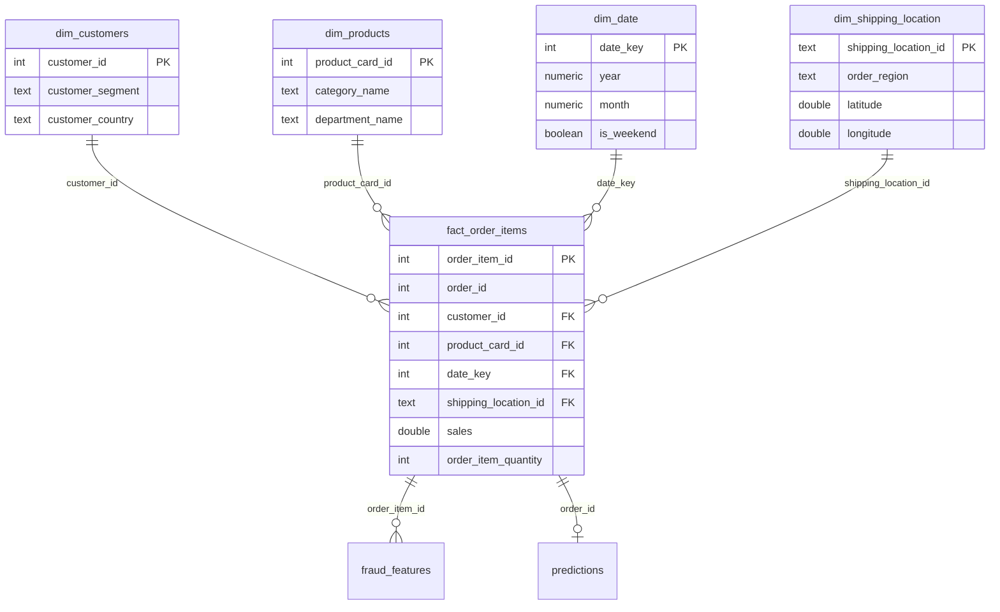
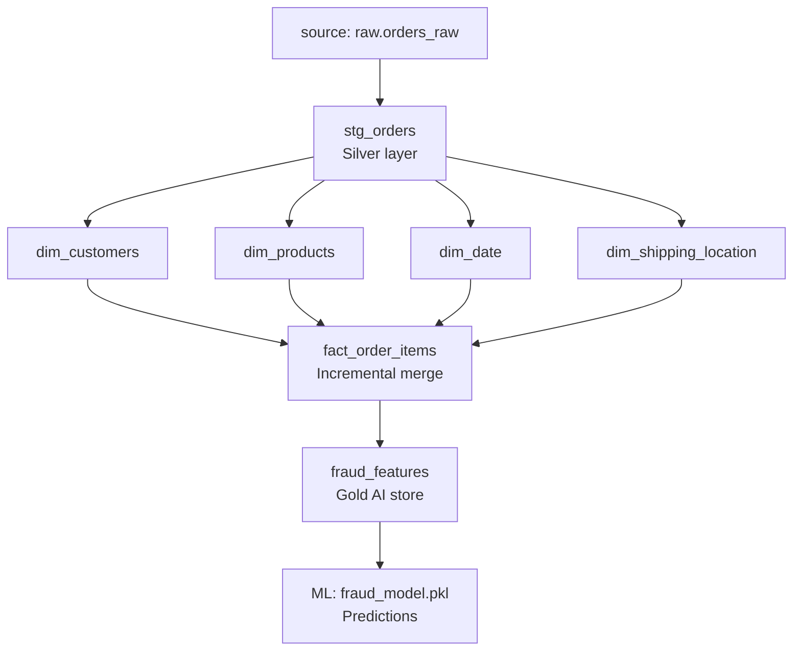
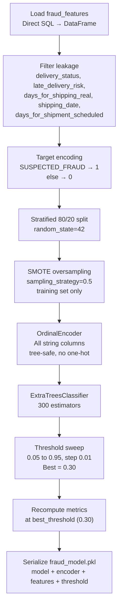
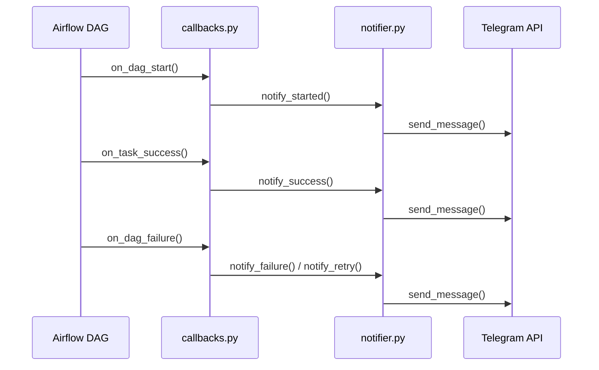
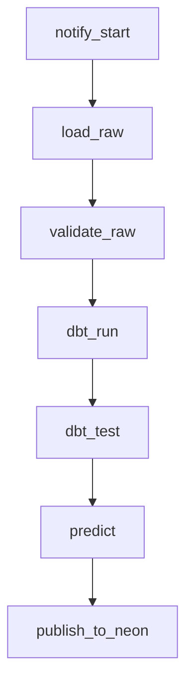

# Architecture

Full technical reference for the DataCo Supply Chain platform — medallion layers, schemas, pipeline lifecycle, ML workflow, and Kimball dimensional design.

---

## Table of Contents

- [Medallion Architecture](#medallion-architecture)
- [Folder Structure](#folder-structure)
- [Pipeline Lifecycle](#pipeline-lifecycle)
- [Kimball Dimensional Model](#kimball-dimensional-model)
- [Database Schemas](#database-schemas)
- [Data Dictionary](#data-dictionary)
- [dbt Lineage](#dbt-lineage)
- [ML Workflow](#ml-workflow)
- [Neon Sync Strategy](#neon-sync-strategy)
- [Telegram Notifications](#telegram-notifications)
- [Airflow DAG](#airflow-dag)
- [Incremental Strategy](#incremental-strategy)
- [Error Handling](#error-handling)
- [Environment Variables & Services](#environment-variables--services)
- [Design Notes & Future Improvements](#design-notes--future-improvements)


## Folder Structure

```
.
├── airflow/dags/supply_chain_pipeline.py     7-task Airflow DAG
├── config/sync_tables.yml                    Neon sync table registry
├── dbt/dataco_analytics/
│   ├── macros/generate_schema_name.sql       Schema override
│   └── models/
│       ├── staging/stg_orders.sql            Silver cleaning layer
│       ├── marts/                            dim_*, fact_order_items, schema.yml (31 tests)
│       └── ai/fraud_features.sql             Gold AI feature store
├── docker/airflow.Dockerfile
├── docs/                                     Architecture & data docs (this file)
├── ml/
│   ├── config.py, feature_engineering.py
│   ├── train.py, predict.py, threshold_optimization.py
│   ├── saved_models/fraud_model.pkl          Serialized inference artifact
│   └── reports/                              metrics.json, confusion_matrix.png, roc_curve.png
├── notifications/                            callbacks, notifier, formatter, providers, metrics, history
├── scripts/
│   ├── load_raw.py, validate_raw.py
│   ├── publish_to_neon.py, create_neon_schema.sql
│   └── create_notifications_log.sql
├── raw/DataCoSupplyChainDataset.csv
├── docker-compose.yml
├── requirements.txt
└── Makefile
```

---

## Pipeline Lifecycle

```mermaid
stateDiagram-v2
    [*] --> notify_start : Telegram: Pipeline Started
    notify_start --> load_raw

    state load_raw {
        [*] --> csv_load : Incremental CSV → PostgreSQL
        csv_load --> raw_exists : Raw table exists
        csv_load --> csv_new : Raw table created
        csv_new --> raw_exists
        raw_exists --> [*]
    }

    load_raw --> validate_raw
    state validate_raw {
        [*] --> pending_check
        pending_check --> rows_found : validation_status = 'in_progress'
        pending_check --> no_rows : No pending rows
        no_rows --> [*] : Exit 0 (skipped)
        rows_found --> null_check : NULL % < 1.5
        rows_found --> fail_null : NULL % >= 1.5
        null_check --> dup_check
        dup_check --> date_check
        date_check --> status_check
        status_check --> [*] : All passed
    }

    validate_raw --> dbt_run
    state dbt_run {
        [*] --> staging : stg_orders
        staging --> dims : dim_customers, dim_products, dim_date, dim_shipping_location
        dims --> fact : fact_order_items (incremental merge)
        fact --> ai : fraud_features (Gold AI)
    }

    dbt_run --> dbt_test
    state dbt_test {
        [*] --> uniqueness
        uniqueness --> not_null
        not_null --> relationships
        relationships --> [*] : All passed
    }

    dbt_test --> predict
    state predict {
        [*] --> load_model : Load fraud_model.pkl
        load_model --> predict_new : LEFT JOIN on predictions
        predict_new --> all_done : No unscored orders
        all_done --> [*]
        predict_new --> encode : OrdinalEncoder
        encode --> threshold : Apply threshold 0.30
        threshold --> upsert : INSERT ON CONFLICT
    }

    predict --> publish_to_neon
    state publish_to_neon {
        [*] --> reset_seq : Reset Neon sequences
        reset_seq --> sync_dims : Full refresh (DELETE + INSERT)
        sync_dims --> sync_fact : UPSERT on PK
        sync_fact --> sync_pred : Incremental by modified_at
        sync_pred --> [*]
    }

    publish_to_neon --> notify_success : Telegram: Pipeline Success
    notify_success --> [*]

    load_raw --> notify_failure : Task Failed
    validate_raw --> notify_failure
    dbt_run --> notify_failure
    dbt_test --> notify_failure
    predict --> notify_failure
    publish_to_neon --> notify_failure
    notify_failure --> [*]
```



---

## Kimball Dimensional Model

The warehouse follows a **classic star schema**: one central fact table (`fact_order_items`), four denormalized dimensions joined by single-hop foreign keys, and no snowflaking. This shape optimizes for BI read performance and business-user comprehension rather than write-side normalization.

**Grain:** one row = one order line item (`order_item_id`) — the most atomic level available in the source data. Every higher-level aggregate (daily, monthly, by customer, by region) rolls up from this grain.



| Table | Why it's a Fact / Dimension |
|---|---|
| `fact_order_items` | Holds numeric, additive **measures** (Sales, Profit, Discount, Quantity) plus only foreign keys — the signature of a fact table. |
| `dim_date` | Slowly-changing calendar attributes tied to a surrogate key. Type 0 — calendar facts never change. |
| `dim_customers` | Descriptive attributes answering "who" — segment, geography. Type 1 (overwrite). |
| `dim_products` | Descriptive attributes answering "what" — name, price, category, department. Type 1. |
| `dim_shipping_location` | Descriptive attributes answering "where/how" — destination geography, shipping mode. |

### Measure additivity

| Measure | Type | Notes |
|---|---|---|
| `sales`, `order_item_total`, `order_item_discount`, `order_item_quantity` | **Fully additive** | Summable across any dimension. |
| `sales_per_customer` | **Non-additive** | Recalculate as `SUM(sales)/COUNT(DISTINCT customer)`. |
| `benefit_per_order`, `order_profit_per_order` | **Semi-additive** | Order-level values repeated per line item. |
| `order_item_discount_rate`, `order_item_profit_ratio` | **Non-additive** | Ratios — use weighted averages, never sum. |
| `days_for_shipping_real`, `days_for_shipment_scheduled` | **Non-additive** | Duration metrics — average/median only. |

**Degenerate dimensions** (no separate table, live directly on the fact row): `payment_type`, `delivery_status`, `order_status`.

---

## Database Schemas

### `raw.orders_raw`
Landing table — raw CSV columns preserved as-is, plus audit columns (`etl_run_id`, `ingested_at`, `validation_status`).

### `staging.stg_orders`
dbt view performing cleaning, renaming, and typing (silver layer).

### `warehouse.dim_customers`
One row per customer (deduplicated to most recent order's attributes). PK: `customer_id`.

### `warehouse.dim_products`
One row per product. PK: `product_card_id`.

### `warehouse.dim_date`
One row per calendar date present in the order data. PK: `date_key` (`YYYYMMDD`).

### `warehouse.dim_shipping_location`
Shipping destination dimension with a surrogate key (`dbt_utils.generate_surrogate_key`). PK: `shipping_location_id`.

### `warehouse.fact_order_items`
Grain: one row per order item. Incremental (merge on `order_item_id`). FKs into all four dimensions above.

### `warehouse.fraud_features`
Gold AI layer — single source of truth for ML. All feature engineering (joins, temporal derivation, leakage/PII exclusion, target computation) happens in SQL.

**Excluded (leakage):** `delivery_status`, `late_delivery_risk`, `days_for_shipping_real`, `shipping_date`, `days_for_shipment_scheduled`
**Excluded (PII):** `customer_first_name`, `customer_last_name`, `customer_street`, `customer_city`, `customer_zipcode`

### `warehouse.predictions`
One row per order, upsert-safe (`ON CONFLICT (order_id) DO UPDATE`).

### `warehouse.etl_runs`
Pipeline run monitoring — one row per `load_raw.py` execution.

### `warehouse.notifications_log`
Telegram notification audit trail (event type, channel, status, timestamp).

---

## Data Dictionary

<details>
<summary><strong>fact_order_items</strong> — full column list</summary>

| Column | Type | Description |
|---|---|---|
| order_item_id | int, PK | Unique order item identifier |
| order_id | int, FK | Parent order identifier |
| customer_id | int, FK → dim_customers | Customer who placed the order |
| product_card_id | int, FK → dim_products | Product ordered |
| date_key | int, FK → dim_date | Order date key |
| shipping_location_id | varchar, FK → dim_shipping_location | Shipping destination |
| payment_type | varchar | Payment method |
| delivery_status | varchar | Delivery outcome (Late, On Time) |
| order_status | varchar | COMPLETE, CANCELED, SUSPECTED_FRAUD |
| late_delivery_risk | int | Binary flag (0/1) |
| shipping_mode | varchar | Shipping method |
| order_date / shipping_date | timestamp | Placement / ship dates |
| days_for_shipping_real / days_for_shipment_scheduled | float | Actual vs. scheduled shipping days |
| sales, sales_per_customer, benefit_per_order, order_profit_per_order | float | Financial measures |
| order_item_total, order_item_discount, order_item_discount_rate, order_item_profit_ratio | float | Line-item financials |
| order_item_quantity | int | Quantity (≥ 1) |

</details>

<details>
<summary><strong>fraud_features</strong> (Gold AI) — full column list</summary>

| Column | Type | Description |
|---|---|---|
| order_item_id, order_id, customer_id | int | Identifiers |
| payment_type, shipping_mode, customer_segment, category_name, department_name, order_region, order_country | varchar | Categorical features |
| order_item_quantity, sales, sales_per_customer, benefit_per_order, order_profit_per_order, order_item_total, order_item_discount, order_item_discount_rate, order_item_profit_ratio, product_price, latitude, longitude | numeric | Numerical features |
| order_month, order_day, order_hour, order_day_of_week | int | Temporal features |
| is_weekend | boolean | Weekend flag |
| order_status | varchar | Raw status text (dropped before training) |
| target | int | 1 = SUSPECTED_FRAUD, 0 = clean |
| created_at | timestamp | Row creation timestamp |

</details>

<details>
<summary><strong>predictions</strong> — full column list</summary>

| Column | Type | Description |
|---|---|---|
| prediction_id | serial, PK | Auto-incrementing ID |
| order_id | int, UNIQUE | Order identifier |
| fraud_probability | float | Model output probability (0–1) |
| predicted_label | boolean | True if fraud (threshold applied) |
| threshold_used | float | Classification threshold (0.30) |
| model_version, pipeline_version | varchar | Version strings |
| predicted_at, created_at, modified_at | timestamp | Lifecycle timestamps |

</details>

**Data quality note:** 412 rows have negative `sales` values. Investigated and confirmed these correspond exclusively to `CANCELED` and `SUSPECTED_FRAUD` order statuses — a legitimate refund/loss signal, not bad data. Preserved (not filtered); validation scopes the "sales ≥ 0" rule to exclude those statuses.

---

## dbt Lineage



**Schema override** (`macros/generate_schema_name.sql`): `staging` → `warehouse.stg_orders`; `marts` → `warehouse.dim_*` / `fact_order_items`; `ai` → `warehouse.fraud_features`.

**Tests:** 31 dbt tests enforce uniqueness, not-null, and referential integrity (including 4 FK relationship tests) across all warehouse tables.

---

## ML Workflow



| Component | Detail |
|---|---|
| Model | ExtraTreesClassifier (300 estimators) |
| Features | 24 columns (payment, shipping, geography, temporal, financial) |
| Threshold | 0.30 (optimized via sweep 0.05–0.95) |
| Resampling | SMOTE (sampling_strategy=0.5, training set only) |
| Encoding | OrdinalEncoder (tree-safe, no one-hot) |
| Split | Stratified 80/20 (random_state=42) |
| Target | `order_status = 'SUSPECTED_FRAUD'` → 1, else 0 |
| Class balance | 2.25% fraud (4,066 / 180,519) → 43.4:1 imbalance |
| Inference artifact | `fraud_model.pkl` — model + fitted OrdinalEncoder + feature_columns + threshold + model_version |

### Performance (test set, 36,144 rows)

| Metric | Value |
|---|---|
| Precision | 0.4013 |
| Recall | 0.3727 |
| F1 | 0.3865 |
| ROC-AUC | 0.9497 |

### Usage

```bash
python train.py                     # retrain → saves fraud_model.pkl + reports
python predict.py --order-id 5349   # predict one order (upsert)
python predict.py --all-new         # predict all unscored orders (idempotent)
```

---

## Neon Sync Strategy

| Table | Sync Mode | PK Strategy | Rationale |
|---|---|---|---|
| dim_customers | full | `customer_id` | Low cardinality (~20K rows), full refresh fast |
| dim_products | full | `product_card_id` | Tiny (118 rows), instant refresh |
| dim_date | full | `date_key` | Static (1,127 rows), never changes |
| dim_shipping_location | full | `shipping_location_id` | Moderate (~65K rows), acceptable full refresh |
| fact_order_items | upsert | `order_item_id` | Large (180K+), append-only with PK diff |
| predictions | incremental | `order_id` | 65K+ rows, `modified_at` delta; SERIAL excluded from INSERT |

`_reset_neon_sequences()` resets the Neon SERIAL sequence to `MAX(prediction_id) + 1` before upserting predictions to avoid conflicts.

### Setup

```bash
psql "postgresql://neondb_owner:<password>@ep-xxx-pooler.us-east-1.aws.neon.tech/neondb?sslmode=require" \
  -f scripts/create_neon_schema.sql

python scripts/publish_to_neon.py               # incremental sync (default)
python scripts/publish_to_neon.py --full-sync   # force full sync
```

---

## Telegram Notifications



Enterprise-style HTML messages cover: Pipeline Started, Pipeline Summary, Pipeline Failed, and Model Retrained events.

---

## Airflow DAG

**DAG:** `supply_chain_pipeline` · **Schedule:** `@daily` · **Retries:** 2 per task, 5-min delay



| Task | Script | Timeout |
|---|---|---|
| notify_start | `notifications/notifier.py` | 30 sec |
| load_raw | `scripts/load_raw.py` | 15 min |
| validate_raw | `scripts/validate_raw.py` | 5 min |
| dbt_run | `dbt run` | 10 min |
| dbt_test | `dbt test` | 10 min |
| predict | `ml/predict.py --all-new` | 5 min |
| publish_to_neon | `scripts/publish_to_neon.py` | 10 min |

---

## Incremental Strategy

| Stage | Strategy |
|---|---|
| Load | `NOT EXISTS` on `order_item_id` — never re-inserts existing rows |
| Validate | Queries `WHERE validation_status = 'in_progress'` — only the current run |
| dbt fact | Incremental merge on `order_item_id` |
| ML predict | `LEFT JOIN` against `warehouse.predictions` — only scores unscored orders |
| Neon dims | Full refresh (DELETE + INSERT) |
| Neon fact | UPSERT on PK |
| Neon predictions | Incremental by `modified_at` |

---

## Error Handling

| Stage | Failure Mode | Behavior |
|---|---|---|
| `load_raw.py` | CSV not found / connection error | DAG fails after 2 retries |
| `validate_raw.py` | NULL % ≥ 1.5% | Writes `validation_status = 'failed'`, exits non-zero |
| `validate_raw.py` | 0 pending rows | Exits 0 (skipped) |
| `dbt run` / `dbt test` | Build or test failure | DAG fails, logs SQL/test error |
| `predict.py` | No unscored orders | Exits 0 (skipped) |
| `predict.py` | Model file missing | Raises `FileNotFoundError` |
| `publish_to_neon.py` | Connection / sequence conflict | Retries; `_reset_neon_sequences()` resets SERIAL before upsert |
| Any task | Task failure | Telegram notification with error + retry count |

---

## Environment Variables & Services

| Variable | Purpose |
|---|---|
| `DATABASE_URL` | PostgreSQL connection |
| `NEON_HOST`, `NEON_PORT`, `NEON_DATABASE`, `NEON_USER`, `NEON_PASSWORD` | Neon connection |
| `TELEGRAM_BOT_TOKEN`, `TELEGRAM_CHAT_ID` | Telegram alerting |
| `MLFLOW_TRACKING_URI` | Optional MLflow server |

| Service | Port | Description |
|---|---|---|
| PostgreSQL | 5432 | Local database |
| pgAdmin | 5050 | Database GUI |
| Airflow | 8080 | Orchestration (admin/admin) |
| Metabase | 3000 | Open-source BI |
| Tableau | — | Connects to Neon externally |

---

## Design Notes & Future Improvements

**Known modeling trade-off:** in an earlier iteration of this warehouse, `dim_shipping_location` was keyed directly on `order_id` rather than a deduplicated surrogate key, effectively making it a degenerate dimension rather than a reusable conformed one. The current schema keys it on a `dbt_utils` surrogate key instead, deduplicated on the location attributes — the recommended fix.

Planned improvements:

- **SCD Type 2** on `dim_customers` and `dim_products` via `dbt snapshot`, using `effective_date` / `expiration_date` / `is_current` to track historical segment, address, and price changes.
- **CDC ingestion** (Debezium/Kafka) to replace full CSV reloads.
- **Cloud deployment** (AWS/GCP/Azure) with Terraform.
- **Data lake landing zone** (S3/MinIO) ahead of Postgres.
- **CI pipeline** running `dbt test`, `validate_raw.py`, and a `train.py` smoke test on every push.
- **Partitioning** `fact_order_items` by `date_key` (range partitioning) as data volume grows.
- **Pre-aggregated rollup tables** (e.g., monthly sales by category) for high-traffic executive dashboards.

---

*End of document.*