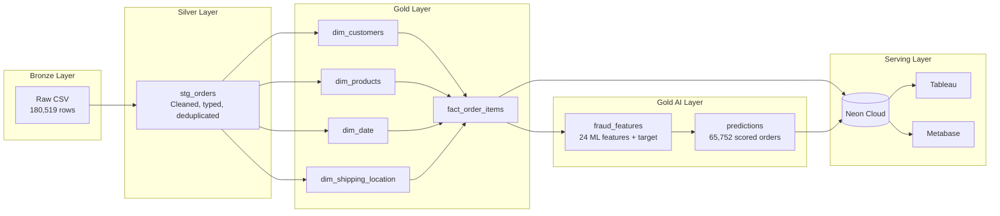
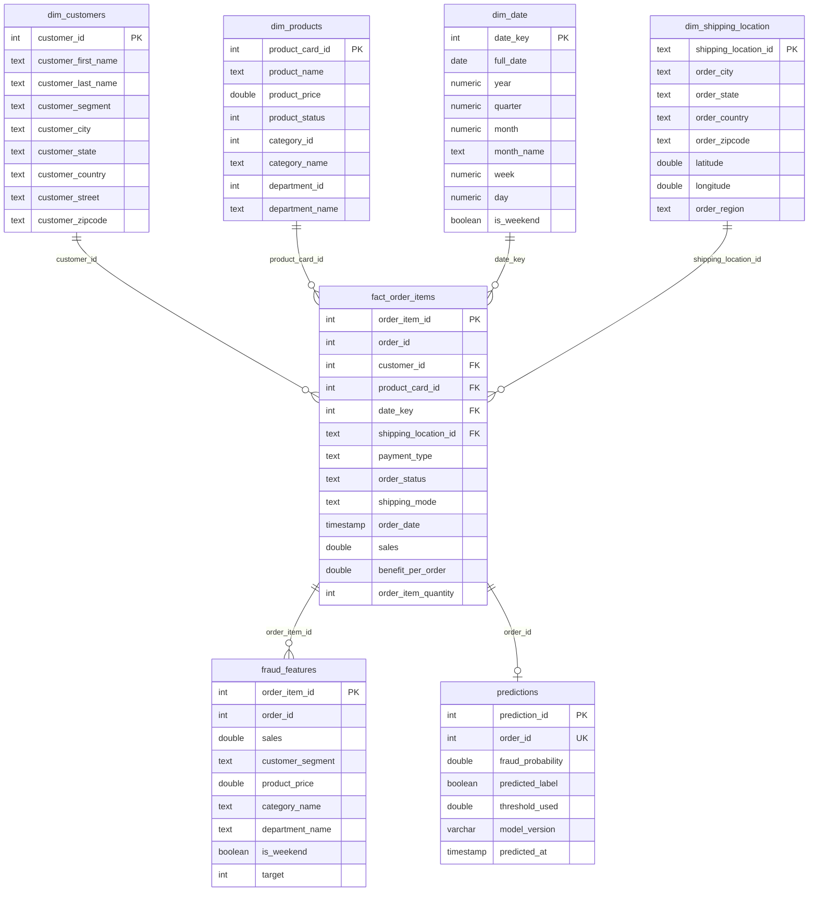
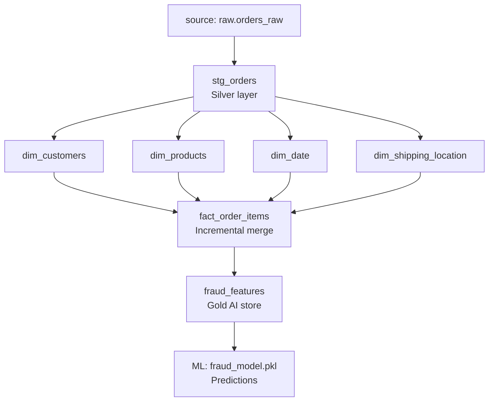
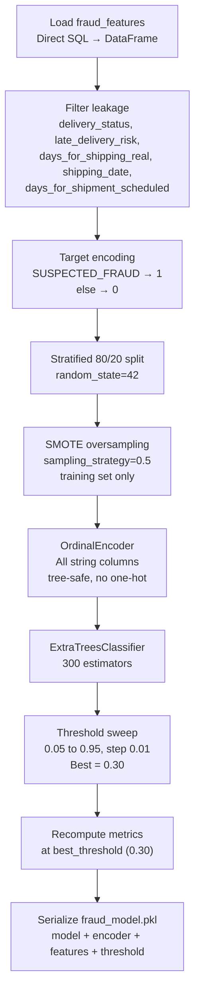
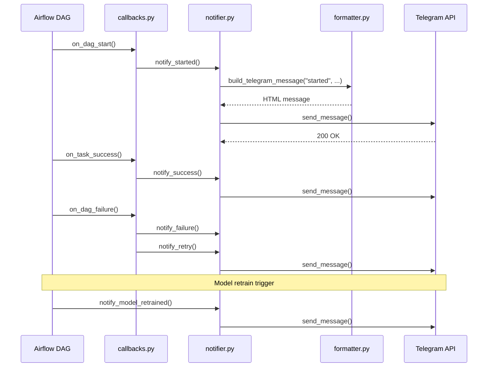
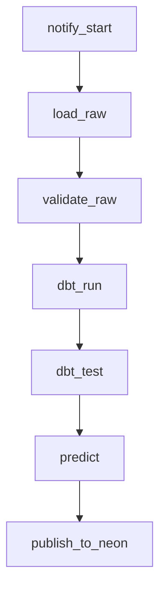

# Architecture

This document describes every layer of the DataCo Supply Chain Analytics platform — from raw CSV ingestion through ML prediction and live dashboard serving.

---

## Medallion Architecture



---

## Folder Structure

```
.
├── airflow/
│   └── dags/
│       └── supply_chain_pipeline.py     # 7-task Airflow DAG
├── config/
│   └── sync_tables.yml                  # Neon sync table registry
├── dbt/
│   └── dataco_analytics/
│       ├── dbt_project.yml
│       ├── packages.yml                 # dbt_utils 1.4.1
│       ├── macros/
│       │   └── generate_schema_name.sql # Schema override
│       └── models/
│           ├── staging/
│           │   └── stg_orders.sql       # Silver cleaning layer
│           ├── marts/
│           │   ├── dim_customers.sql
│           │   ├── dim_products.sql
│           │   ├── dim_date.sql
│           │   ├── dim_shipping_location.sql
│           │   ├── fact_order_items.sql # Incremental
│           │   └── schema.yml           # 31 dbt tests
│           └── ai/
│               ├── fraud_features.sql   # Gold AI feature store
│               └── schema.yml
├── docker/
│   └── airflow.Dockerfile
├── docs/
│   ├── ARCHITECTURE.md                  # This file
│   ├── SETUP.md
│   └── DEMO_RECORDING_GUIDE.md
├── ml/
│   ├── config.py
│   ├── feature_engineering.py           # Direct SQL → DataFrame
│   ├── train.py                         # Model training
│   ├── predict.py                       # Production prediction
│   ├── threshold_optimization.py
│   ├── saved_models/
│   │   └── fraud_model.pkl             # Serialized inference artifact
│   └── reports/
│       ├── metrics.json
│       ├── confusion_matrix.png
│       └── roc_curve.png
├── notifications/
│   ├── callbacks.py
│   ├── notifier.py
│   ├── formatter.py
│   ├── providers.py
│   ├── metrics.py
│   └── history.py
├── scripts/
│   ├── load_raw.py
│   ├── validate_raw.py
│   ├── publish_to_neon.py
│   ├── create_neon_schema.sql
│   └── create_notifications_log.sql
├── raw/
│   └── DataCoSupplyChainDataset.csv
├── docker-compose.yml
├── requirements.txt
├── Makefile
└── .env.example
```

---

## Pipeline Lifecycle

```mermaid
stateDiagram-v2
    [*] --> notify_start : Telegram: Pipeline Started
    notify_start --> load_raw

    state load_raw {
        [*] --> csv_load : Incremental CSV → PostgreSQL
        csv_load --> raw_exists : Raw table exists
        csv_load --> csv_new : Raw table created
        csv_new --> raw_exists
        raw_exists --> [*]
    }

    load_raw --> validate_raw
    state validate_raw {
        [*] --> pending_check
        pending_check --> rows_found : validation_status = 'in_progress'
        pending_check --> no_rows : No pending rows
        no_rows --> [*] : Exit 0 (skipped)
        rows_found --> null_check : NULL % < 1.5
        rows_found --> fail_null : NULL % >= 1.5
        null_check --> dup_check
        dup_check --> date_check
        date_check --> status_check
        status_check --> [*] : All passed
    }

    validate_raw --> dbt_run
    state dbt_run {
        [*] --> staging : stg_orders
        staging --> dims : dim_customers, dim_products, dim_date, dim_shipping_location
        dims --> fact : fact_order_items (incremental merge)
        fact --> ai : fraud_features (Gold AI)
    }

    dbt_run --> dbt_test
    state dbt_test {
        [*] --> uniqueness
        uniqueness --> not_null
        not_null --> relationships
        relationships --> [*] : All passed
    }

    dbt_test --> predict
    state predict {
        [*] --> load_model : Load fraud_model.pkl
        load_model --> predict_new : LEFT JOIN on predictions
        predict_new --> all_done : No unscored orders
        all_done --> [*]
        predict_new --> encode : OrdinalEncoder
        encode --> threshold : Apply threshold 0.30
        threshold --> upsert : INSERT ON CONFLICT
    }

    predict --> publish_to_neon
    state publish_to_neon {
        [*] --> reset_seq : Reset Neon sequences
        reset_seq --> sync_dims : Full refresh (DELETE + INSERT)
        sync_dims --> sync_fact : UPSERT on PK
        sync_fact --> sync_pred : Incremental by modified_at
        sync_pred --> [*]
    }

    publish_to_neon --> notify_success : Telegram: Pipeline Success
    notify_success --> [*]

    load_raw --> notify_failure : Task Failed
    validate_raw --> notify_failure
    dbt_run --> notify_failure
    dbt_test --> notify_failure
    predict --> notify_failure
    publish_to_neon --> notify_failure
    notify_failure --> [*]
```



---

## Database Schemas

### PostgreSQL (Local)

#### `raw.orders_raw`

Source data loaded from CSV. Append-only, never modified.

| Column | Type | Description |
|--------|------|-------------|
| order_item_id | integer | Primary key (source) |
| order_id | integer | Order identifier |
| customer_id | integer | Customer reference |
| order_date | date | Order placement date |
| order_status | text | **SUSPECTED_FRAUD** or NORMAL |
| sales | double precision | Line item revenue |
| benefit_per_order | double precision | Profit/loss per item |
| order_item_quantity | integer | Units ordered |
| payment_type | text | Payment method |
| shipping_mode | text | Shipping tier |
| shipping_date | date | Shipment date |
| delivery_status | text | Delivery status |
| category_name | text | Product category |
| department_name | text | Department |
| product_card_id | integer | Product reference |
| product_price | double precision | Unit price |
| order_item_total | double precision | Total for line item |
| order_profit_per_order | double precision | Profit for line item |
| order_item_discount | double precision | Discount amount |
| order_item_discount_rate | double precision | Discount rate |
| order_item_profit_ratio | double precision | Profit margin |
| sales_per_customer | double precision | Revenue per customer |
| customer_first_name | text | First name |
| customer_last_name | text | Last name |
| customer_segment | text | Segment |
| customer_city | text | City |
| customer_state | text | State |
| customer_country | text | Country |
| customer_street | text | Street address |
| customer_zipcode | text | Zipcode |
| order_city | text | Order city |
| order_state | text | Order state |
| order_country | text | Order country |
| order_region | text | Order region |
| order_zipcode | text | Order zipcode |
| latitude | double precision | Latitude |
| longitude | double precision | Longitude |
| validation_status | text | pending / in_progress / passed / failed |
| etl_run_id | integer | Foreign key to etl_runs |

#### `warehouse.dim_customers`

| Column | Type | Description |
|--------|------|-------------|
| customer_id | integer | Primary key |
| customer_first_name | text | First name |
| customer_last_name | text | Last name |
| customer_segment | text | Segment |
| customer_city | text | City |
| customer_state | text | State |
| customer_country | text | Country |
| customer_street | text | Street address |
| customer_zipcode | text | Zipcode |

#### `warehouse.dim_products`

| Column | Type | Description |
|--------|------|-------------|
| product_card_id | integer | Primary key |
| product_name | text | Product name |
| product_price | double precision | Unit price |
| product_status | integer | Status flag |
| category_id | integer | Category reference |
| category_name | text | Category name |
| department_id | integer | Department reference |
| department_name | text | Department name |

#### `warehouse.dim_date`

| Column | Type | Description |
|--------|------|-------------|
| date_key | integer | Primary key (YYYYMMDD) |
| full_date | date | Date value |
| year | numeric | Year |
| quarter | numeric | Quarter (1-4) |
| month | numeric | Month (1-12) |
| month_name | text | Month name |
| week | numeric | ISO week |
| day | numeric | Day of month |
| is_weekend | boolean | Weekend flag |

#### `warehouse.dim_shipping_location`

| Column | Type | Description |
|--------|------|-------------|
| shipping_location_id | text | Primary key |
| order_city | text | City |
| order_state | text | State |
| order_country | text | Country |
| order_zipcode | text | Zipcode |
| latitude | double precision | Latitude |
| longitude | double precision | Longitude |
| order_region | text | Region |

#### `warehouse.fact_order_items`

| Column | Type | Description |
|--------|------|-------------|
| order_item_id | integer | Primary key |
| order_id | integer | Order identifier |
| customer_id | integer | FK → dim_customers |
| product_card_id | integer | FK → dim_products |
| date_key | integer | FK → dim_date |
| shipping_location_id | text | FK → dim_shipping_location |
| payment_type | text | Payment method |
| order_status | text | Order status |
| shipping_mode | text | Shipping tier |
| order_date | date | Order date |
| sales | double precision | Revenue |
| benefit_per_order | double precision | Profit/loss |
| order_item_quantity | integer | Units |

#### `warehouse.fraud_features`

| Column | Type | Description |
|--------|------|-------------|
| order_item_id | integer | Primary key |
| order_id | integer | Order identifier |
| sales | double precision | Revenue |
| customer_segment | text | Segment |
| product_price | double precision | Unit price |
| category_name | text | Category |
| department_name | text | Department |
| order_item_quantity | integer | Units |
| payment_type | text | Payment method |
| shipping_mode | text | Shipping tier |
| order_region | text | Region |
| order_country | text | Country |
| sales_per_customer | double precision | Revenue per customer |
| benefit_per_order | double precision | Profit/loss |
| order_profit_per_order | double precision | Order-level profit |
| order_item_total | double precision | Line total |
| order_item_discount | double precision | Discount amount |
| order_item_discount_rate | double precision | Discount rate |
| order_item_profit_ratio | double precision | Profit margin |
| order_month | numeric | Month (1-12) |
| order_day | numeric | Day of month |
| order_hour | numeric | Hour |
| order_day_of_week | numeric | Day of week |
| is_weekend | boolean | Weekend flag |
| latitude | double precision | Latitude |
| longitude | double precision | Longitude |
| target | integer | 1 = SUSPECTED_FRAUD, 0 = else |

#### `warehouse.predictions`

| Column | Type | Description |
|--------|------|-------------|
| prediction_id | integer | Primary key (SERIAL) |
| order_id | integer | UNIQUE — FK → fact_order_items |
| fraud_probability | double precision | Model output probability |
| predicted_label | boolean | threshold 0.30 → 1/0 |
| threshold_used | double precision | 0.30 |
| model_version | varchar | "1.1.0" |
| predicted_at | timestamp | Prediction timestamp |
| created_at | timestamp | Row creation |
| modified_at | timestamp | Row modification |

#### `warehouse.etl_runs`

| Column | Type | Description |
|--------|------|-------------|
| run_id | integer | Primary key (SERIAL) |
| started_at | timestamp | Run start |
| finished_at | timestamp | Run end |
| status | text | running / succeeded / failed |

#### `warehouse.notifications_log`

| Column | Type | Description |
|--------|------|-------------|
| notification_id | integer | Primary key (SERIAL) |
| etl_run_id | integer | FK → etl_runs |
| event_type | text | started / success / failure / model_retrained |
| channel | text | telegram |
| status | text | sent / failed |
| created_at | timestamp | Log timestamp |

---

## Data Model (ERD)



---

## dbt Lineage



**Schema override:** `macros/generate_schema_name.sql` routes models:
- `staging` → `warehouse.stg_orders`
- `marts` → `warehouse.dim_customers`, `warehouse.fact_order_items`, etc.
- `ai` → `warehouse.fraud_features`

**Tests:** 31 dbt tests enforce uniqueness, not-null, and referential integrity across all warehouse tables.

---

## ML Workflow



**Key details:**

| Component | Detail |
|-----------|--------|
| Model | ExtraTreesClassifier (300 estimators) |
| Features | 24 columns (payment, shipping, geography, temporal, financial) |
| Threshold | 0.30 (optimized via sweep 0.05–0.95) |
| Resampling | SMOTE (sampling_strategy=0.5, training set only) |
| Encoding | OrdinalEncoder (tree-safe, no one-hot) |
| Split | Stratified 80/20 (random_state=42) |
| Target | `order_status = 'SUSPECTED_FRAUD'` → 1, else 0 |
| Class Balance | 2.25% fraud (4,066 / 180,519) → 43.4:1 imbalance |
| Inference artifact | `fraud_model.pkl` — model + fitted OrdinalEncoder + feature_columns + threshold + model_version |

---

## Neon Sync Strategy

| Table | Sync Mode | PK Strategy | Excludes | Rationale |
|-------|-----------|-------------|----------|-----------|
| dim_customers | full | `customer_id` | — | Low cardinality (20K rows), full refresh fast |
| dim_products | full | `product_card_id` | — | Tiny (118 rows), full refresh instant |
| dim_date | full | `date_key` | — | Static (1,127 rows), never changes |
| dim_shipping_location | full | `shipping_location_id` | — | Moderate (65K rows), full refresh acceptable |
| fact_order_items | upsert | `order_item_id` | — | Large (180K+), append-only with upsert for PK diff |
| predictions | incremental | `order_id` | `prediction_id` | 65K+ rows, modified_at delta; SERIAL excluded from INSERT |

**`_reset_neon_sequences()`**: Before upserting predictions, resets the Neon SERIAL sequence to `MAX(prediction_id) + 1` to avoid conflicts.

---

## Telegram Notifications



**Message format:** Enterprise-style HTML with sections (Pipeline Started, Pipeline Summary, Pipeline Failed, Model Retrained).

---

## Airflow DAG

**DAG:** `supply_chain_pipeline`  
**Schedule:** `@daily` (manual triggers also supported)  
**Retries:** 2 per task, 5-min delay  
**Callbacks:** Telegram notifications on start, success, failure, and retry



| Task | Script | Timeout |
|------|--------|---------|
| notify_start | `notifications/notifier.py` | 30 sec |
| load_raw | `scripts/load_raw.py` | 15 min |
| validate_raw | `scripts/validate_raw.py` | 5 min |
| dbt_run | `dbt run` | 10 min |
| dbt_test | `dbt test` | 10 min |
| predict | `ml/predict.py --all-new` | 5 min |
| publish_to_neon | `scripts/publish_to_neon.py` | 10 min |

---

## Incremental Strategy

| Stage | Strategy | Details |
|-------|----------|---------|
| **Load** | `NOT EXISTS` on `Order Item Id` | Never re-inserts existing rows; idempotent |
| **Validate** | Queries `WHERE validation_status = 'in_progress'` | Only validates the current run |
| **dbt fact** | Incremental merge on `order_item_id` | Updates changed rows, inserts new |
| **ML predict** | `LEFT JOIN` against `warehouse.predictions` | Only scores unscored orders |
| **Neon dims** | Full refresh (DELETE + INSERT) | Low cardinality, fast |
| **Neon fact** | UPSERT on PK | Append-only with PK diff |
| **Neon predictions** | Incremental by `modified_at` | Only new/changed predictions synced |

---

## Error Handling

| Stage | Failure Mode | Behavior |
|-------|-------------|----------|
| `load_raw.py` | CSV not found | Exits with error, DAG fails |
| `load_raw.py` | Connection error | Retries 2x, then fails |
| `validate_raw.py` | NULL % ≥ 1.5% | Writes `validation_status = 'failed'`, exits non-zero |
| `validate_raw.py` | 0 pending rows | Exits 0 (skipped) |
| `dbt run` | Model build error | DAG fails, logs SQL error |
| `dbt test` | Test failure | DAG fails, logs failed test |
| `predict.py` | No unscored orders | Exits 0 (skipped) |
| `predict.py` | Model file missing | Raises FileNotFoundError |
| `publish_to_neon.py` | Neon connection | Retries, then fails |
| `publish_to_neon.py` | Sequence conflict | `_reset_neon_sequences()` resets SERIAL before upsert |
| Any task | Task failure | Telegram notification with error + retry count |

---

## Environment Variables

| Variable | Purpose | Required |
|----------|---------|----------|
| `DATABASE_URL` | PostgreSQL connection | Yes |
| `NEON_HOST` | Neon hostname | Yes |
| `NEON_PORT` | Neon port (5432) | Yes |
| `NEON_DATABASE` | Neon database name | Yes |
| `NEON_USER` | Neon username | Yes |
| `NEON_PASSWORD` | Neon password | Yes |
| `TELEGRAM_BOT_TOKEN` | Telegram bot token | Yes |
| `TELEGRAM_CHAT_ID` | Telegram chat ID | Yes |
| `MLFLOW_TRACKING_URI` | MLflow server (optional) | No |

---

## Services

| Service | Port | Description |
|---------|------|-------------|
| PostgreSQL | 5432 | Local database |
| pgAdmin | 5050 | Database GUI |
| Airflow | 8080 | Pipeline orchestration (admin/admin) |
| Metabase | 3000 | Open-source BI |
| Tableau | — | Connect to Neon externally |
